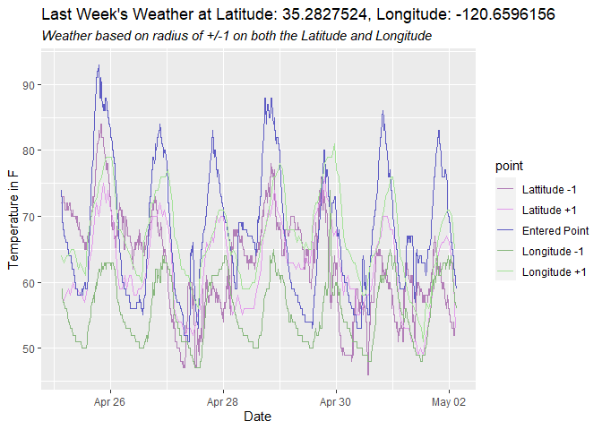

temperaturr
================

The temperaturr package uses the climacell and google maps geocoding
APIs to tell you about the weather by providing data frames and plots of
the weather from certain locations.

## Setup & Installation

First things first we’re gonna need to install the development version
of the package from [Github](https://github.com/) with:

``` r
# install.packages("devtools")
devtools::install_github("kabhatia7/temperaturr")
```

``` r
library(temperaturr)
```

Next we need to get setup with API Keys. The first one for climacell is
very easy to get set up just click this
[link](https://developer.climacell.co/sign-up) to sign up for a free
climacell key. Then to store your key as in your global environment to
be used for all functions in the `temperaturr` package

I will be reading in our keys from a JSON file as they should not be
used by more than one person.

``` r
register_climacell_key(apikey = jsonlite::read_json("keys.json")$climacell)
```

The free version gives us 1000 calls a day and which for the purposes of
this package should be more than enough. The next key you’re going to
want to get is the Google API for geocoding. This key will make it so
you don’t have to always look up your location of interest by simply
passing the name of the location of interest. We will use the ggmap
package to register our google key with the `register_google()`
function. Instructions for a google key can be found
[here](https://developers.google.com/maps/documentation/geocoding/get-api-key).

``` r
#install.packages(ggmap)
library(ggmap)
#> Loading required package: ggplot2
#> Google's Terms of Service: https://cloud.google.com/maps-platform/terms/.
#> Please cite ggmap if you use it! See citation("ggmap") for details.
register_google(key = jsonlite::read_json("keys.json")$google)
```

Then you can set your location through the `find_loc()` function so you
wont have to pass any of the lat and lon arguments for the functions.
Try to be as specific as possible by adding state names or zip codes
since google will always pick the first result it searches for if there
are conflicts.

``` r
find_loc("San Luis Obispo, CA")
#> Source : https://maps.googleapis.com/maps/api/geocode/json?address=San+Luis+Obispo,+CA&key=xxx
```

Now we’re all set to use the package\!

## Retrieving a temperaturr data frame

``` r
get_prev_temp() %>% 
  head()
#> # A tibble: 6 x 6
#>   observation_time     year month   day temp_in_F temp_in_C
#>   <dttm>              <dbl> <dbl> <int>     <dbl>     <dbl>
#> 1 2020-04-25 03:05:00  2020     4    25      74.0      23.3
#> 2 2020-04-25 03:15:00  2020     4    25      72        22.2
#> 3 2020-04-25 03:25:00  2020     4    25      71.0      21.7
#> 4 2020-04-25 03:35:00  2020     4    25      69.0      20.6
#> 5 2020-04-25 03:45:00  2020     4    25      69.0      20.6
#> 6 2020-04-25 03:55:00  2020     4    25      68        20
```

## Hourly comparison of today and day before in a dataframe

``` r
weather_comparison() 
#>             Day1_Times Day1_Temp_in_F Day1_Temp_in_C          Day2_Times
#> 1  2020-05-03 03:00:00          54.70          12.61 2020-05-04 03:00:00
#> 2  2020-05-03 04:00:00          54.71          12.62 2020-05-04 04:00:00
#> 3  2020-05-03 05:00:00          54.78          12.66 2020-05-04 05:00:00
#> 4  2020-05-03 06:00:00          54.13          12.29 2020-05-04 06:00:00
#> 5  2020-05-03 07:00:00          54.71          12.62 2020-05-04 07:00:00
#> 6  2020-05-03 08:00:00          60.02          15.57 2020-05-04 08:00:00
#> 7  2020-05-03 09:00:00          65.86          18.81 2020-05-04 09:00:00
#> 8  2020-05-03 10:00:00          68.36          20.20 2020-05-04 10:00:00
#> 9  2020-05-03 11:00:00          68.85          20.47 2020-05-04 11:00:00
#> 10 2020-05-03 12:00:00          68.89          20.49 2020-05-04 12:00:00
#> 11 2020-05-03 13:00:00          68.42          20.23 2020-05-04 13:00:00
#> 12 2020-05-03 14:00:00          67.27          19.59 2020-05-04 14:00:00
#> 13 2020-05-03 15:00:00          66.04          18.91 2020-05-04 15:00:00
#> 14 2020-05-03 16:00:00          64.99          18.33 2020-05-04 16:00:00
#> 15 2020-05-03 17:00:00          63.22          17.34 2020-05-04 17:00:00
#> 16 2020-05-03 18:00:00          61.43          16.35 2020-05-04 18:00:00
#> 17 2020-05-03 19:00:00          59.00          15.00 2020-05-04 19:00:00
#> 18 2020-05-03 20:00:00          55.40          13.00 2020-05-04 20:00:00
#> 19 2020-05-03 21:00:00          55.40          13.00 2020-05-04 21:00:00
#> 20 2020-05-03 22:00:00          55.40          13.00 2020-05-04 22:00:00
#> 21 2020-05-03 23:00:00          55.40          13.00 2020-05-04 23:00:00
#> 22 2020-05-04 00:00:00          55.40          13.00 2020-05-05 00:00:00
#> 23 2020-05-04 01:00:00          53.60          12.00 2020-05-05 01:00:00
#> 24 2020-05-04 02:00:00          53.60          12.00 2020-05-05 02:00:00
#>    Day2_Temp_in_F Day2_Temp_in_C Diffrence_in_F Diffrence_in_C
#> 1            51.8             11           2.90           1.61
#> 2            51.8             11           2.91           1.62
#> 3            51.8             11           2.98           1.66
#> 4            51.8             11           2.33           1.29
#> 5            51.8             11           2.91           1.62
#> 6            57.2             14           2.82           1.57
#> 7            62.6             17           3.26           1.81
#> 8            66.2             19           2.16           1.20
#> 9            69.8             21          -0.95          -0.53
#> 10           71.6             22          -2.71          -1.51
#> 11           71.6             22          -3.18          -1.77
#> 12           69.8             21          -2.53          -1.41
#> 13           69.8             21          -3.76          -2.09
#> 14           66.2             19          -1.21          -0.67
#> 15           66.2             19          -2.98          -1.66
#> 16           64.4             18          -2.97          -1.65
#> 17           60.8             16          -1.80          -1.00
#> 18           57.2             14          -1.80          -1.00
#> 19           57.2             14          -1.80          -1.00
#> 20           59.0             15          -3.60          -2.00
#> 21           59.0             15          -3.60          -2.00
#> 22           57.2             14          -1.80          -1.00
#> 23           57.2             14          -3.60          -2.00
#> 24           57.2             14          -3.60          -2.00
```

## Plot the weather patterns for the past week

``` r
plot_weather(CF = "F", num_days = 7)
```


